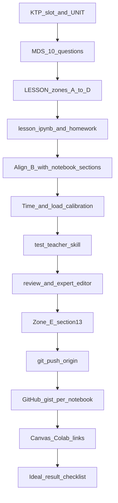

# Lesson Design

Статус: Draft 5

## Назначение

Lesson Design отвечает на один вопрос:

**Как устроен `LESSON.md`, чтобы преподаватель мог провести пару?**

Документ заполняется **до** (или вместе с) созданием ноутбуков и ДЗ. Общие правила материалов — Material Design Standard. Контекст модуля — Unit Planner.

`LESSON.md` — **сценарий пары** для преподавателя, не конспект для ученика. Главный читатель — учитель, который **завтра ведёт** урок и не писал план.

**Правило:** один `LESSON.md` = **одна** пара КТП = 2 академических часа (учёт) = **80 минут** проведения. Ориентиры времени в зоне A и колонка «~мин» в B **всегда** суммируются в **80** (не диапазон).

---

## Как пользоваться

1. Пройти обязательные вопросы MDS §2.
2. Заполнить зоны **A → E** ниже (порядок в файле = порядок чтения учителя).
3. Проверить критерий: незнакомый учитель по зонам A–C отвечает без догадок:
   - что открыть в первую минуту;
   - какие 3–5 блоков и в каком порядке;
   - как понять, что пара сдана;
   - что сказать на типичной ошибке.
4. Согласовать колонку «Материал» в зоне B с реальными разделами ноутбука / путями файлов.
5. Чек-лист MDS §11.
6. Калибровка пары (раздел ниже): время и нагрузка для сильного ядра vs смешанного класса.
7. Перед публикацией в Canvas — [полный цикл](#полный-цикл-от-слота-ктп-до-canvas) (фазы 0–12).

### Зоны файла (сверху вниз)

| Зона | Заголовок в файле | Для кого |
|---|---|---|
| **A** | Сценарий пары | ведёт / готовится |
| **B** | Ход пары | ведёт |
| **C** | Если сбились | ведёт |
| **D** | Проектирование | автор / ревью / test-teacher |
| **E** | Карточка урока (§13) | школьный экспорт |

Зоны A–C — **канон проведения**. Зона E — **экспорт** в школьную форму (не сценарий). Не копировать одни и те же фразы в A–C и E трижды: E сжимает то, что уже сказано выше.

В **Canvas** (скрытый «План урока») публикуются только зоны **A–C**; D и E остаются в репозитории (автор курса / школьный экспорт). Подробнее — [08_CANVAS §11.4](08_CANVAS.md).

### Как читать поля

| Зона / поле | Что писать | Чего избегать |
|---|---|---|
| A: Открыть | Конкретный файл + как раздать | «материалы урока» |
| A: Первая фраза | Одна готовая фраза классу | Тезис для себя |
| A: Минимум сдачи | Наблюдаемый результат пары | «понял тему» |
| A: Время | Ориентиры на блоки, сумма **80 мин** | Поминутный тайминг; диапазоны 80–90 |
| B: Материал | Раздел `# …` в `lesson.ipynb` или путь к файлу | «см. ноутбук» без якоря |
| B: Критерий закрытия | Как увидеть, что этап сдан | «обсудили» |
| B: Учитель (устно) | Фраза, которую можно сказать классу без нераскрытого жаргона | `sklearn`, `fit`, `model.predict` до соответствующего модуля |
| C: Ошибки | Симптом ученика + что сказать/показать | Пустой тип |
| D | Сжато: зачем, идея, результаты, ML, решения, ДЗ; мосты к sklearn и профконтекст | Повтор таблицы B; копировать D в ноутбук |
| E (§13) | Поля школьной строки полными фразами | Жаргон без расшифровки; **постановка / выдача ДЗ** в «Стратегиях обучения» |

---

## Шаблон `LESSON.md`

```markdown
# Lesson Design: <название как в КТП>

## A. Сценарий пары

| Поле | Значение |
|---|---|
| Модуль | |
| Название урока | как в КТП / для журнала |
| Пара КТП | N |
| Длительность | 2 академических часа (**80 минут** проведения) |
| Роль | ориентация / введение / отработка / интеграция |
| Пререквизиты | одной строкой: умения / предыдущая пара |
| **Открыть** | файл + как раздать классу |
| **Первая фраза** | |
| **Минимум сдачи** | |
| **Дальше** | следующая пара / LESSON |
| **Домашнее задание** | путь к `homework.ipynb` / `homework.md` / `homework.py` |
| **Canvas** | что выложить в LMS **или** «не на этой паре» (`—`); пайплайн — [08_CANVAS §11](08_CANVAS.md#11-пара-урок-внутри-модуля-canvas) |

### A. Чего хотим от пары

Текст **только для учителя** (зона A → wiki «План урока (для преподавателя)»). Ученические ноутбуки блок A **не** содержат.

**Формат**

- Ровно **1–2 абзаца** связной прозы (полные предложения).
- Абзац 1 — **главная** учебная цель пары (чему учим в первую очередь).
- Абзац 2 (необязателен) — **побочная** цель: тоже полными предложениями, явно вторичная.

Учитель должен за 20–30 секунд понять, зачем пара и что считать успехом по смыслу (не по чеклисту файлов).

**Писать**

- Конкретные цели обучения полными предложениями.
- Обычные ML-термины (accuracy, MAE, model) — можно; при необходимости пояснить в том же предложении, зачем они на паре.
- Явное разделение «главное / побочно», если на паре два уровня целей.

**Не писать**

| Антипаттерн | Почему плохо | Лучше |
|---|---|---|
| Чеклист артефактов / «успех пары» списком сдачи | Минимум сдачи уже в таблице A и в B | Цель обучения словами; сдачу — в таблице |
| Метафоры («формула в тетради» и т.п.) | Не помогают провести пару | Прямое описание навыка |
| Телеграф / ярлыки (`**Основная тема:**`, однострочники) | Не читается как план | 1–2 абзаца прозы |
| Жаргон ноутбука голыми фразами («describe после scale», «копипаст вчерашнего») | Неясно, чему учат | Что ученик **делает и понимает** |
| Тавтология («с устройством профиля: как устроены…») | Пустой повтор | Одно ясное утверждение |
| Перечисление разноранговых вещей в одном списке (правила сдачи + словарь «ИИ» / ML) | Разное не на одном уровне | Разнести по абзацам или предложениям |
| Мета без действия («это уже применение функции, а не новая теория…») | Не сказано, что делают | Сказать, что делают; при необходимости — чем это *не* является |
| «Вчерашние ячейки» и похожие временные отсылки | Путает (чья «вчера»?) | «На прошлой паре», «уже написанные функции», «готовые фрагменты» |

**Примеры (кратко)**

Плохо: «Знакомство с устройством профиля: как устроены модули…; правила сдачи; что означают слова ИИ.»  
Хорошо: абзац про модули/артефакты/сдачу; отдельно — словарь ИИ/ML и сюжет модуля.

Плохо: «Это уже применение функции, а не новая теория про модели.»  
Хорошо: «Вызываем функцию на списке, считаем MAE, сравниваем коэффициенты. „Модель“ здесь — правило с коэффициентом; новую теорию моделей не вводим.»

Плохо: «не повторить вчерашние ячейки один в один.»  
Хорошо: «перенести уже написанные функции на новый набор данных, а не только заново прогнать готовые фрагменты.»

Минимум сдачи и ход — в таблице A и в B. На Canvas — этот блок ([08_CANVAS §11.4](08_CANVAS.md#114-план-пары-wiki-для-преподавателя)). «Ориентир времени» и «Сценарий пары» в план не входят. Правила формулировок A — **здесь**; в `08_CANVAS` только фильтр тела wiki.

---

## B. Ход пары

**Один источник задач на паре** — эта таблица (отдельный список «активностей» не дублировать).
На отработке в колонках B должно быть ≥ 3 задачи **одной цели** (MDS §5, Pedagogy §2).

| # | Этап | ~мин | Ученик | Учитель | Материал | Критерий закрытия |
|---|---|---|---|---|---|---|
| 1 | | | | | `lesson.ipynb` → `## …` | |

Этапов обычно 4–7. Введение и отработку одного навыка — **два** `LESSON.md`, не один файл.

---

## C. Если сбились

### Типичные ошибки

| Симптом / мысль ученика | Что сказать или показать |
|---|---|
| | |

### Дифференциация (кратко)

| | |
|---|---|
| Слабее базы | |
| Сильнее базы | |

---

## D. Проектирование

Сжатый блок для автора и ревью. **Не повторять** ход пары из B.

### Зачем урок

1. Какой пробел в способностях закрывает (1 абзац).
2. Почему стоит именно здесь в модуле.

### Центральная идея

| Поле | Значение |
|---|---|
| Центральная идея | одно предложение (MDS §4) |
| Что поддерживает, но не отвлекает | без новой темы |
| Данные урока | имена из `data/` или «нет» |

### Результаты обучения

После пары учащийся может… (наблюдаемые глаголы, MDS §3). Список должен совпадать с минимумом сдачи (A) и критериями в B.

### Профессиональный контекст

1–3 конкретные отсылки (API, практика). Не «важно в жизни».

### Решения учащегося

| # | Какой выбор делает учащийся | На что влияет |
|---|---|---|
| 1 | | |

«Написать код по образцу» — не решение. Если решений нет — перепроектировать (MDS §6).

### Материалы (зачем каждый)

- [ ] ноутбук — …
- [ ] `solutions.ipynb` — эталонные решения урока и ДЗ (только преподаватель)
- [ ] датасеты — …
- [ ] starter — …
- [ ] презентация — … **или** «не нужна»
- [ ] ПО / прочее — …

### Домашнее задание

| Поле | Значение |
|---|---|
| Назначается | **да** (обязательно на каждой паре) |
| Файл | `homework.ipynb` / `homework.md` / `homework.py` в папке урока |
| Формулировка | кратко; полный текст — в файле ДЗ |
| Ориентир времени | **1 час** |
| Почему не на уроке | что перенесено и зачем |
| Какую способность развивает | наблюдаемый результат |

ДЗ не заменяет отработку на паре практики (Pedagogy §2).

---

## Домашнее задание

**У каждой пары** — домашнее задание. Исключений нет (вводная пара — короткое рефлексивное ДЗ допустимо).

| Правило | Пояснение |
|---|---|
| Отдельный файл | В папке урока: `homework.ipynb`, `homework.md`, `homework.py` или `homework_<slug>.py` / `.md` — **не** раздел в `lesson.ipynb` |
| Именование | По умолчанию `homework.*`; второй файл — только если явно нужен (напр. `homework.md` + `homework_starter.py`) |
| Объём | **1 час** самостоятельной работы (ориентир при проектировании) |
| Состав | **Закрепление** (простые задачи для слабее базы) + **база** + **углубление** + хотя бы одна задача **вызова** (логика / математика / алгоритм; MDS §6) |
| Интерес в ДЗ | Самые **интересные и увлекательные** задачи пары — в ДЗ (вызов, неожиданный поворот, свой эксперимент), а не только «добить то же самое с пары». На паре — ядро навыка; дома — то, за что хочется сесть |
| Связь с парой | Продолжает или закрепляет навык пары; не дублирует минимум сдачи на уроке целиком |
| Самодостаточность | Те же правила, что для ноутбука: данные inline, без `module_datasets`, пререквизиты по [карте инструментов](07_KTP.md#карта-инструментов) |
| В `LESSON.md` | Зона A — путь к файлу ДЗ; зона D — таблица ДЗ; зона B — постановка на паре (~5 мин в конце) |

Формат выбора:

| Формат | Когда |
|---|---|
| `homework.ipynb` | Код, assert, эксперименты (типично для профиля) |
| `homework.md` | Письменный отчёт, разбор, мало кода |
| `homework.py` | Один скрипт с `manual_tests` / assert |

Чек-лист урока: файл ДЗ существует; указан в A и D; есть закрепление и задача вызова; ориентир **1 час**.

### Уровни задач в ДЗ

| Уровень | Назначение | Кто |
|---|---|---|
| **A. Закрепление** | Повтор с пары, 1–2 шага, assert | минимум сдачи для слабее базы |
| **B. База** | Новый шаг в рамках навыка пары | все |
| **C. Углубление** | Больше данных, параметров, кода | средний и сильный уровень |
| **D. Вызов** | Контрпример, обоснование, смена критерия, «можно ли» | сильнее базы; попытка желательна от всех |

Маркировка в файле ДЗ: заголовки `## A. …`, `## B. …` или явная пометка «закрепление» / «вызов».

---

## E. Карточка урока (§13)

Обязательна для экспорта. Поля — [reference/SCHOOL_UNIT_PLANNER.md](../reference/SCHOOL_UNIT_PLANNER.md#строка-урока).
Название урока — в зоне A. **Последний** раздел файла.

Писать полными фразами; содержание согласовано с A–C (не новый урок «для формы»).

**Стратегии обучения / виды деятельности** — только **учебная деятельность** на паре (из зоны B: исследование, код, эксперимент, обсуждение, разбор ошибок). **Не включать:** постановку ДЗ, напоминание о сроках сдачи, организационные инструкции — это зона B (этап учителя) и зона D (файл `homework.*`), не школьная стратегия.

| Поле | Значение |
|---|---|
| Часы | 2 |
| Стратегии обучения / виды деятельности | виды **учебной** деятельности из B (без постановки ДЗ) |
| Формирующее оценивание | из минимума сдачи + критериев B |
| Дифференциация | из зоны C |
| По содержанию | |
| По процессу | |
| По продукту | |
| Canvas (опционально) | как в A; если «не на этой паре» — `—` |
```

---

## Отработка (код)

| Правило | Смысл |
|---|---|
| Роль | введение **или** отработка; отдельный `LESSON.md` на каждую пару |
| Серия | на отработке ≥ 3 задачи одной цели — в зоне B |
| Проверка | assert / ожидаемый вывод / критерий в колонке B |
| Материал | каждая задача привязана к разделу ноутбука или файлу |

Урок только с объяснением и одним упражнением-показом — перепроектировать (MDS §5).

---

## Калибровка пары

Проверка **до** утверждения `LESSON.md`: хватит ли 80 минут смешанному классу и не будет ли скуки у сильного ядра.

### Как оценивать

| Ось | Вопрос | Сигнал перекоса |
|---|---|---|
| Время | Сколько минут **активной** работы у сильного ядра на минимум сдачи? | >2× короче суммы в зоне B — пара завышена по времени для однородно сильного потока |
| Идея | Есть ли одна новая мысль, которую нельзя заменить чтением? | Идея есть, но урок всё равно «лёгкий» — усилить **исполнение**, не добавлять темы |
| Исполнение | Учащийся **проектирует** или **переписывает** готовое? | Много `pass` + assert на 1–2 примера, готовые фрагменты кода — нагрузка низкая |
| Повтор | Есть ли дубли с соседней парой? | Один и тот же эксперимент на введении и отработке — ощущение повтора у сильных |
| Дифференциация | Достаточна ли ветка «сильнее базы» для топ-10%? | Только «сделай то же на полном датасете» — слабо |

**Правило:** календарь КТП (80 мин × N пар) **не сжимается** из-за сильного ядра. Сильным — углубление внутри пары или aspirational-трек (Pedagogy §10).

### Эталон: пары 2–3 модуля `08_01` (пилот)

Аудитория оценки: одарённые учащиеся 8 класса, сильная база Python (7 класс), спецматематика; однородный поток уровня отбора по всей России.

**Вердикт:** как старт модуля для **смешанного** класса — нормально; как **две полные пары** для однородно сильного ядра — завышено по времени (~2×), занижено по интеллектуальной нагрузке задач. Реалистично: **1–1,5 пары** активной работы на минимум сдачи; остальное — углубление или ускоренный переход при сохранении двух пар в КТП.

#### Пара 2 — введение (`02_function_as_mapping`)

| Блок (зона B) | Заложено | Активная работа сильного ядра |
|---|---|---|
| Правило без имени | 10 мин | 3–5 мин |
| `predict_price` | 15 мин | 5–10 мин |
| `return` vs `print` + MAE | 25 мин | 10–15 мин |
| Эксперимент с коэффициентом | 20 мин | 5–10 мин |
| Буфер | 10 мин | — |
| **Итого** | **80** | **~25–40 мин** |

| Критерий | Оценка |
|---|---|
| Нагрузка идеи | средняя: «предсказание = функция с `return`» — уместный мост к ML |
| Нагрузка исполнения | низкая: формула дана, MAE в list comprehension готов |
| Минимум сдачи | достижим без нетривиальных решений |
| Ветка «сильнее» | слабая: только этап 4 (два коэффициента) |

#### Пара 3 — введение (`03_parameters_and_return`)

| Блок (зона B) | Заложено | Активная работа сильного ядра |
|---|---|---|
| `describe_numbers` | 20 мин | 8–12 мин |
| `min_max_scale` | 20 мин | 8–12 мин |
| `clip_outlier` | 15 мин | 5–8 мин |
| mutable default | 15 мин | 8–10 мин |
| `grade_stats` | 10 мин | 5–7 мин |
| **Итого** | **80** | **~35–50 мин** |

| Критерий | Оценка |
|---|---|
| Нагрузка идеи | средняя: контракт transform — нужный мост |
| Нагрузка исполнения | средняя: больше кода, чем на паре 2; mutable default — нетривиально |
| Дублирование | clip + подбор порога ≈50% вынесены в ДЗ; на паре — один clip и фиксированный порог |
| Ветка «сильнее» | в зоне C: полный перебор в ДЗ, `transform_pipeline` — на паре 4 |

#### Пара 4 — отработка (`04_practice_transform`)

| Блок (зона B) | Заложено | Активная работа сильного ядра |
|---|---|---|
| Опора (вставка функций) | 5 мин | 2–3 мин |
| Describe `LAB_SCORES` | 15 мин | 5–8 мин |
| Два scale | 15 мин | 8–10 мин |
| Порог «ровно k» | 20 мин | 10–15 мин |
| `apply_transform` | 20 мин | 10–15 мин |
| **Итого** | **80** | **~40–55 мин** |

| Критерий | Оценка |
|---|---|
| Нагрузка идеи | средняя: перенос контракта + композиция fn |
| Нагрузка исполнения | средняя: нет блока `pass` на функции; §4 — не дубль ДЗ пары 3 |
| Дублирование | намеренно нет clip всей выборки и порога ≈50% на паре |
| Ветка «сильнее» | `transform_pipeline(*fns)`; письменное обоснование preprocess в ДЗ |

#### Сводка пилота

| | Пара 2 | Пара 3 | Пара 4 | Для однородно сильного потока |
|---|---|---|---|---|
| Время | ~2× запас | ~1,5× запас | ~1,3–1,5× запас | углубление в C, не сжатие КТП |
| Идеи | достаточно | достаточно | достаточно | исполнение усиливать на 2; 3–4 — приемлемо |
| Действие при ревью | усилить MAE/batch | ДЗ vs пара — ок | калибровка в A | зона C обязательна |

#### Направления усиления (без смены архитектуры модуля)

| Пара | Сильнее базы (зона C / ноутбук) |
|---|---|
| 2 | MAE без готового шаблона; таблица ошибок по коэффициентам |
| 3 | полный перебор в ДЗ; обоснование clip |
| 4 | `transform_pipeline(*fns)`; сравнение стратегий preprocess письменно |
| 2–4 | обобщённая `evaluate(fn, data)`; batch через `map` (задел к паре 8) |

При следующем ревью пилота — обновить эту таблицу фактическими правками в `LESSON.md` и ноутбуках.

---

## Миграция существующих `LESSON.md`

Старые файлы (§1–§11 + «Для учителя») переводить в зоны A–E **по одному**, начиная с модуля 1.

Эталон формата: [modules/08_01_functions_recursion/lessons/02_function_as_mapping/LESSON.md](../modules/08_01_functions_recursion/lessons/02_function_as_mapping/LESSON.md).

### Чек-лист миграции одного урока

- [ ] Зона A заполнена (открыть, фраза, минимум сдачи, время, Canvas явен)
- [ ] Зона B — единственный список задач; колонка «Материал» совпадает с ноутбуком
- [ ] Нет формулировок, противоречащих ноутбуку
- [ ] Зона C — ошибки + дифференциация
- [ ] Зона D сжата (без копипаста B)
- [ ] §13 (E) заполнена; Canvas согласован с A
- [ ] Калибровка: для сильного ядра есть ветка C; нет дубля с соседней парой
- [ ] Файл ДЗ в папке урока; зона A и D ссылаются на него без нового слоя

### Очередь модуля `08_01` (после принятия пилота пары 2)

| Пара | Папка | Статус |
|---|---|---|
| 2 | `02_function_as_mapping` | пилот predict (Draft 5) |
| 3 | `03_parameters_and_return` | пилот transform введение (Draft 5) |
| 4 | `04_practice_transform` | пилот transform отработка (Draft 5) |
| 5 | `05_scope_and_debugging` | пилот метрики введение (Draft 5) |
| 6 | `06_practice_metrics` | пилот метрики отработка (Draft 5) |
| 1 | `01_intro_profile` | мигрировать |
| 7 | `07_recursion` | мигрировать |
| 8 | `08_practice_pipeline` | мигрировать |
| 9–10 | `09_artifact_build`, `10_artifact_submit` | мигрировать |

Не создавать второй файл «сценарий / дизайн» (правило 99).

---

## Границы документа

| В Lesson Design | Не здесь |
|---|---|
| Шаблон и правила `LESSON.md` | Зачем модуль → Unit Planner |
| Калибровка времени и нагрузки пары | Принцип дифференциации → Pedagogy §10 |
| Как читать зоны A–E | Общие правила материалов → MDS |
| Карточка §13 | Маппинг школьной формы → `reference/` (только чтение) |
| Полный цикл до Canvas | Раздел ниже; детали LMS → [08_CANVAS §11](08_CANVAS.md) |

---

## Полный цикл: от слота КТП до Canvas

Оркестрация одной пары: **репозиторий** — источник правды; **Canvas** — витрина для класса. Правила материалов не дублируются здесь — только порядок фаз и ссылки на канон.

**Идеальный результат:** незнакомый учитель ведёт пару по зонам A–C без автора; ученик работает в самодостаточных ноутбуках (Colab в отдельной вкладке); ДЗ по правилам (~1 ч); в LMS скрыт `LESSON.md`, открыты ссылки на ноутбуки; §13 заполнен.



### Фазы

| Фаза | Что делаем | Канон / инструмент | Критерий выхода |
|---|---|---|---|
| **0. Контекст** | Слот в КТП, строка в `UNIT.md` §11, пререквизиты, карта инструментов | [07_KTP](07_KTP.md), [ktp/08.md](ktp/08.md), `UNIT.md` §14 | Номер пары, роль (введение / отработка), нет забегания по инструментам |
| **1. Проектирование** | 10 вопросов MDS; одна центральная идея; ≥1–2 решения учащегося | [MDS §2–7](02_MATERIAL_DESIGN_STANDARD.md) | Ответы в зоне D (или черновик) |
| **2. LESSON.md A–C** | Сценарий, ход, «если сбились»; сумма времени **80 мин** | Шаблон выше | Четыре вопроса из § «Как пользоваться» — без догадок |
| **3. Материалы** | `lesson.ipynb` (если нужен); **обязательно** `homework.*` (~1 ч, уровни A–D); `solutions.ipynb` | [Notebook Standard](05_NOTEBOOK_STANDARD.md) §3 «Деятельность», `generate_notebooks.py` | Stubs+assert в уроке/ДЗ (не прогон готовых ответов); ДЗ с вызовом; `solutions` покрывает **все** задачи; эталон глубины — `08_01` / пара 2; без intro/итога; данные по §3 Notebook |
| **4. Согласование** | Колонка «Материал» B = якоря `## …` в ноутбуке; A «Открыть» = реальный файл | Пилот: [02_function_as_mapping](../modules/08_01_functions_recursion/lessons/02_function_as_mapping/) | Нет противоречий между B и ipynb |
| **5. Калибровка** | Время и нагрузка: сильное ядро vs смешанный класс | § «Калибровка пары» выше | Зона C «сильнее / слабее»; нет дубля с соседней парой |
| **6. Test-teacher** | Skill `test-teacher`: вопросы учителя → правки в том же цикле | `.cursor/skills/test-teacher/SKILL.md` | Учитель не спрашивает «что открыть в первую минуту» |
| **7. Ревью** | `review-edu-material`; при необходимости `expert-edu-editor` | Skills + [MDS §11](02_MATERIAL_DESIGN_STANDARD.md) | Вердикт «готово» или правки закрыты |
| **8. Экспорт §13** | Зона E: все поля школьной строки | § E выше; правило §13 без ДЗ в «Стратегиях» | §13 согласован с A–C |
| **9. Git push** | Commit + `git push origin` | [08_CANVAS §11.3](08_CANVAS.md) | Версия на GitHub = источник для gist |
| **10. Gist** | Один gist на каждый `.ipynb` (включая `solutions.ipynb`) | `gh gist create … --public` | Gist соответствует запушенному коммиту |
| **11. Canvas** | SubHeader; скрытый план (wiki); скрытые решения; ExternalUrl → Colab; **Assignment** сдачи ДЗ | [08_CANVAS §11.3.1–11.3.2](08_CANVAS.md) | Промежуточная страница Canvas — норма; Colab в новой вкладке |
| **12. Фиксация** | Поле **Canvas** в A и §13; Colab-URL; при необходимости `UNIT.md` | `LESSON.md` | Не `—`; ссылки рабочие |
| **12a. Матрица навыков** | Строка пары в [ktp/08_skills_matrix.md](ktp/08_skills_matrix.md) — если изменились вводимые/отрабатываемые навыки | [07_KTP § Матрица навыков](07_KTP.md) | Термины согласованы с ролью урока и правилами матрицы |

### Ссылки на ноутбуки: Google Colab

После gist — в Canvas элемент **ExternalUrl** на Colab (не nbviewer). Канон: [08_CANVAS §11.3.1](08_CANVAS.md).

```
https://colab.research.google.com/gist/{user}/{gist_id}/{filename}.ipynb
```

Ученик: клик в модуле → промежуточная страница Canvas → Colab в **новой вкладке** (`new_tab=true`). Это принятое поведение, не баг.

Проверка перед публикацией: Colab открывает ноутбук, ячейки выполняются сверху вниз.

### Чек-лист «идеальный результат»

- [ ] Одна центральная идея; результаты обучения наблюдаемы (MDS §3–4)
- [ ] Зоны A–C: открыть, фраза, минимум сдачи, 80 мин, ход без пробелов
- [ ] Зона B согласована с разделами `lesson.ipynb`
- [ ] `homework.*` отдельно; ~1 ч; уровни A–D (закрепление + вызов)
- [ ] Ноутбук: stubs+assert (не предзаполненные ответы); `solutions` полные; глубина ≥ эталона `08_01`
- [ ] Ноутбук: данные по Notebook Standard; без забегания по карте инструментов
- [ ] Калибровка и дифференциация (зона C) заполнены
- [ ] Test-teacher пройден без блокирующих вопросов
- [ ] §13 полный; «Стратегии» без постановки ДЗ
- [ ] **Не** публиковать в gist/Canvas scaffold («Run All» без работы ученика)
- [ ] `git push`; gist из запушенной версии
- [ ] Canvas: план и решения скрыты; урок — ExternalUrl + Colab; ДЗ — Assignment «Домашнее задание» (§11.3.2)
- [ ] Поле Canvas в A и §13 обновлено
- [ ] Строка пары в [матрице навыков](ktp/08_skills_matrix.md) актуальна, если менялись навыки ([07_KTP](07_KTP.md))

**Эталон:** пара 2 модуля `08_01` — [папка урока](../modules/08_01_functions_recursion/lessons/02_function_as_mapping/), [08_CANVAS §11.5](08_CANVAS.md).

### Вне scope цикла одной пары

| Задача | Где |
|---|---|
| Проектирование модуля (`UNIT.md`) | [Unit Planner](03_UNIT_PLANNER.md) |
| Перенумерация КТП | отдельное решение по [ktp/08.md](ktp/08.md) |
| Все пары модуля в Canvas | повтор фаз 11–12 для каждой пары |
| Школьный unit planner | Unit Planner §20 + `reference/` (только чтение) |

### Обновление после публикации

Правка в git → `push` → обновить gist при необходимости → `publish_canvas_lesson.py --update-page-only --page-url …` → зафиксировать в [08_CANVAS §11.5](08_CANVAS.md) и зоне A `LESSON.md`.

### План пары в Canvas

Wiki — отрендеренный MD ([08_CANVAS §11.4](08_CANVAS.md)). Относительные `[lesson.ipynb](…)` / `[homework.ipynb](…)` при публикации → Colab. Ноутбуки в модуле — ExternalUrl + Colab ([§11.3.1](08_CANVAS.md)).
